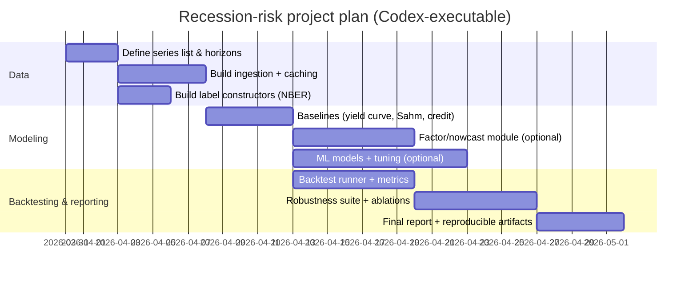

# Measuring U.S. Recession Risk: models, evidence, backtests, and a replication playbook

## Executive summary

Recession-risk measurement is best treated as a **probabilistic classification problem**—forecasting the likelihood of a recession (or recession onset) over a specified horizon—rather than as a single “yes/no” call. The literature shows a broad toolkit spanning **financial-market indicators (yield curve, credit spreads, equities)**, **macro leading indicators (composite indices, surveys)**, **state-space/dynamic factor nowcasting**, **regime-switching (Markov-switching) models**, and **machine learning (ML) classifiers**. citeturn0search0turn0search1turn2search0turn4search0turn61view0

Three practical conclusions are robust across academic work, central-bank research, and practitioner frameworks:

1. **Yield-curve slope measures remain among the most reliable longer-horizon U.S. recession predictors**, especially at horizons like ~6–12 months (or 2–4 quarters), and are widely used in probit/logit early-warning models. citeturn0search0turn0search1turn55search1turn55search8  
2. **Credit spreads are typically better as “late-cycle / near-term stress” indicators** (excellent for detecting or validating imminent/ongoing downturns), but they often underperform yield-curve slopes at long horizons (e.g., 12 months). Credit’s main value is complementarity and detection/calibration of financial stress regimes. citeturn1search2turn60view0  
3. **Composite/nowcasting approaches** (dynamic factor models; indices like ADS/CFNAI; mixed-frequency nowcasting) improve timeliness and robustness by pooling information and handling data-release asynchrony, at the cost of more modeling and data-engineering complexity. citeturn0search3turn2search0turn6search3  

Empirically (U.S. focus), this report backtests representative methods using **NBER recession chronology** from the entity["organization","National Bureau of Economic Research","research org, cambridge, ma, us"] and daily/monthly macro-financial series (via FRED source series and a stable CSV packaging). citeturn34view0turn36view0turn55search3turn60view0turn57view0turn58view0

Key backtest highlights (details in the backtest section):

- A **yield-curve logit** using a 10Y–3M proxy (10-year Treasury minus 3-month T-bill) attains **AUC ≈ 0.866** out-of-sample for “recession occurs within the next 12 months” (expansion months, test 1990–2025-03), with recession-start hit rate **≈ 75%** and median lead time ~**12 months** among hits (definition-specific).  
- A **high-yield (HY) credit-spread logit** excels at **detecting recession state**, achieving **AUC ≈ 0.973** out-of-sample (test 2007–2025-03), consistent with the view that credit spreads price near-term default risk and financial stress.  
- A computed **Sahm-style unemployment-gap signal** behaves primarily as a **recession detection** rule (typical lags of ~1–2 months for post-1990 recessions in this backtest), underscoring its role as “early confirmation” rather than long-horizon forecasting. citeturn0search2turn59view0  

## Problem framing and evaluation design

### What “recession risk” means in practice

For a forecasting system, recession risk must specify:

- **Target definition**: (a) “recession occurs within *H* months” (event-horizon risk), (b) “economy is in recession at *t+H*” (state at horizon), or (c) “recession start within *H* months” (onset forecasting). These differ materially in labels and evaluation. citeturn0search0turn0search1turn34view0turn36view0  
- **Frequency**: monthly is common for macro and NBER dating; daily/weekly for market stress and nowcasts. citeturn55search3turn55search1turn60view0  
- **Decision use-case**: portfolio de-risking, policy monitoring, or operational staffing determine tolerance for false positives (Type I) vs misses (Type II).

### Data labels: NBER chronology and implications

The NBER Business Cycle Dating Committee provides peak/trough months; a standard convention marks recession months from the month after the peak through the trough month. citeturn34view0turn36view0  
This report uses that convention for monthly recession labeling for backtests.

### Performance metrics used

This report reports:

- **ROC/AUC** (ranking quality across thresholds).  
- **Precision/Recall** at a specified threshold (decision quality).  
- **Hit rate (event-level)**: fraction of recession starts preceded or detected by a signal, within a defined window.  
- **Lead time**: months between first signal and recession start (for forecasting) or months between start and first detection (for detection rules).  
- **Calibration**: Brier score and an approximate Expected Calibration Error (ECE) showing whether predicted probabilities match observed frequencies.  

## Literature review and indicator taxonomy

### Yield curve and term-spread models

A large literature—prominently including work by entity["people","Arturo Estrella","economist"] and entity["people","Frederic S. Mishkin","economist"]—shows that Treasury term spreads (e.g., 10Y–3M or 10Y–2Y) contain predictive information for U.S. recessions, often modeled via probit/logit recession-probability regressions. citeturn0search0turn55search1turn55search8  
The entity["organization","Federal Reserve Bank of New York","central bank, new york, us"] publishes a widely followed yield-curve-based recession probability model (probit-style) using the 10Y–3M spread as a key input. citeturn0search1turn55search1turn55search8

**Conceptual mechanism**: inversion/flattening reflects expectations of future policy easing and/or declining growth and inflation; it may also proxy for tighter financial conditions and reduced bank profitability/incentives to supply credit. citeturn0search0turn0search1

### Composite leading indicators and leading-index frameworks

Classical “leading indicator” approaches combine multiple macro series intended to lead business-cycle turning points. Early influential work by entity["people","James H. Stock","economist"] and entity["people","Mark W. Watson","economist"] developed new indexes of coincident and leading indicators, motivating modern composite-index practice. citeturn1search0  
The entity["organization","The Conference Board","business membership org"] provides the Leading Economic Index (LEI) and documents its composite construction and interpretation. citeturn1search1  
International organizations such as the entity["organization","Organisation for Economic Co-operation and Development","international org"] maintain composite leading indicators for member economies, often used by practitioners as cross-checks in global cycle monitoring. citeturn5search10

### Credit spreads, financial conditions, and stress indices

Credit spreads measure compensation for default and illiquidity risk and often widen materially around economic stress. The academic literature (e.g., entity["people","Simon Gilchrist","economist"] and entity["people","Egon Zakrajsek","economist"]) emphasizes that credit spreads embed both expected default risk and time-varying risk premia (e.g., an “excess bond premium”), which can amplify business-cycle fluctuations. citeturn1search2  
Practitioner and central-bank monitoring frequently uses indices such as the ICE BofA HY OAS (as on FRED) to proxy corporate credit stress. citeturn60view0

Financial-conditions indices (FCIs) and stress indices aggregate multiple spreads, equity/volatility measures, and funding conditions into a single summary measure; they are common in central-bank and investment-community dashboards, though they vary in methodology and can be regime-sensitive. citeturn2search3turn8search3

### Dynamic factor models and nowcasting

Nowcasting methods formalize the “data flow” problem—macroeconomic releases arrive at different times and frequencies. Work such as entity["people","Massimiliano Giannone","economist"], entity["people","Lucrezia Reichlin","economist"], and entity["people","David Small","economist"] popularized mixed-frequency nowcasting via factor models to extract real-time signals from many series. citeturn2search0  
The entity["people","Michele Aruoba","economist"]–entity["people","Francis X. Diebold","economist"]–entity["people","Chiara Scotti","economist"] ADS Business Conditions Index exemplifies a high-frequency conditions index, often used for timely monitoring around turning points. citeturn0search3

### Regime-switching and recession-probability filtering

Regime-switching models formalize “expansion vs recession states” as latent regimes. entity["people","James D. Hamilton","economist"]’s Markov-switching framework is foundational, motivating many modern filtered/smoothed recession probability series used by analysts. citeturn4search0  
Related work (e.g., Chauvet–Piger style frameworks) produces real-time recession probabilities that behave like probabilistic “business cycle monitors.” citeturn1search3

### Machine learning classifiers

Recent literature applies ML classifiers (regularized logit, boosted trees, random forests, kNN, etc.) to recession prediction and often reports improved accuracy relative to simple single-predictor probit/logit benchmarks—especially when combining many predictors and tuning carefully. A representative example is the International Journal of Forecasting paper on “Modeling and predicting U.S. recessions using machine learning techniques,” which emphasizes comparative evaluation across horizons and models. citeturn61view0  
Practical caveat: improvements can depend heavily on feature engineering, validation design, and avoiding look-ahead / revision leakage. citeturn61view0turn2search0

## Comparative methods and implementation guidance

The table below summarizes major method families used by academia, central banks, and market practitioners. (The backtest section selects representative methods for empirical evaluation.)

### Comparative table of recession-risk methods

| Method family | Typical output | Main inputs | Core assumptions | Implementation steps | Pros | Cons |
|---|---|---|---|---|---|---|
| Yield curve “rule” (inversion/threshold) | Binary alarm (e.g., spread < 0) | Treasury yields (10Y, 3M/2Y), often from FRED | Term spread captures expectations and/or financial conditions; threshold is stable | Pick spread (10Y–3M, 10Y–2Y); smooth (monthly avg); define inversion duration rule; map to horizon | Simple, transparent; long history; strong empirical track record | Threshold choice arbitrary; can signal “too early”; sensitive to term premia regime shifts citeturn55search1turn55search8turn0search1 |
| Yield curve probit/logit (NY Fed-style) | Calibrated probability | Same as above | Monotonic relation between slope and recession probability; stable link function | Define recession label at horizon; estimate probit/logit; produce probability + confidence; choose thresholds | Probabilistic; supports ROC/calibration; easy to replicate | Coefficients can drift; sensitive to label definition and horizon; term premia shifts can change mapping citeturn0search0turn0search1 |
| Composite leading indicators (LEI/CLI; academic leading indexes) | Index level / growth; sometimes implied risk | Multiple leading components (new orders, claims, spreads, etc.) | Diversification across indicators improves robustness | Build standardized components; weighting scheme; diffusion indexes; map index declines to risk | Broad information set; interpretable components | Component availability/licensing; revisions; weighting choices; may “double-count” correlated signals citeturn1search0turn1search1turn5search10 |
| Dynamic factor “activity indices” (CFNAI, ADS) | Conditions index; sometimes probability | Many macro series; mixed frequency for nowcasts | A small number of latent factors capture common business-cycle variation | Choose panel; preprocess; estimate factor model/state space; update with each release | Timely; handles missingness; strong “situational awareness” around turning points | More engineering; real-time data vintages matter; interpretation less direct citeturn0search3turn2search0turn6search3 |
| Credit spreads / default-risk proxies | Spread level, z-score, regime | HY OAS, IG spreads, EBPs, bank lending standards | Spreads embed default expectations + risk premia; stress tends to be coincident/near-term | Select spread; frequency aggregation; define stress thresholds; optionally fit classifier | Sensitive to financial stress; good for detection and confirmation | Often late for 6–12m horizons; can be distorted by policy backstops and liquidity premia citeturn1search2turn60view0 |
| Labor-market rules (Sahm rule) | Binary “recession likely now” | Unemployment rate (3m avg vs 12m min) | Unemployment rises sharply at/after recession start; rule is stable | Compute 3m avg; compute 12m min; gap; trigger at 0.5pp | Designed for timely detection; simple to explain | Not intended for long-horizon forecasts; may lag fast, shallow recessions; sensitive to real-time revisions citeturn0search2turn41search5 |
| Regime-switching models (Markov switching; filtered probs) | Smoothed/filtered recession probabilities | GDP/industrial production/employment etc. | Expansion/recession regimes are persistent and statistically distinct | Specify MS model; estimate; compute filtered probs; define triggers | Produces probability; captures persistence; good historical fit | Model specification risk; revisions; may lag at turning points citeturn4search0turn1search3 |
| ML classifiers / ensembles | Probabilities + feature importance | Large predictor set (macro + financial) | Signal is learnable from data; stable enough for generalization | Build panel; time-series CV; tune hyperparameters; evaluate by horizon | Can improve accuracy; captures nonlinearities/interactions | High leakage risk; interpretability; stability across regimes; needs robust validation citeturn61view0turn2search0 |
| Structural/large-scale macro models (e.g., FRB/US) | Scenario forecasts; risk via simulation | Many equations/identities | Structural relationships stable; scenario design adequate | Estimate/maintain model; produce baseline; run shocks; map to recession risk | Scenario-rich; policy analysis | Complex; heavy calibration; may miss sudden regime breaks citeturn4search3 |

## Empirical backtest on U.S. data

### Data, sample, and labels

Backtests focus on the entity["country","United States","country"] and use:

- **Recession dating**: NBER peak/trough chronology; recession months defined from month after peak through trough month. citeturn34view0turn36view0  
- **10-year Treasury yield** (daily): FRED series DGS10 (from entity["organization","Board of Governors of the Federal Reserve System","us central bank board"] via entity["organization","Federal Reserve Bank of St. Louis","central bank, st louis, mo, us"]). citeturn55search3turn57view0  
- **3-month Treasury bill** (daily): FRED series DTB3 (used as a short-rate proxy). citeturn58view0  
- **Unemployment rate** (monthly): FRED series UNRATE (source: entity["organization","U.S. Bureau of Labor Statistics","labor statistics agency"] via FRED). citeturn41search5turn59view0  
- **HY credit spread** (daily): ICE BofA US High Yield Option-Adjusted Spread, FRED series BAMLH0A0HYM2 (source includes entity["company","ICE Data Indices, LLC","index provider"]). citeturn60view0  

Daily series are aggregated to **monthly averages** for alignment with monthly recession dating and unemployment.

**Forecasting target (primary)**: for each month *t* in expansions, label 1 if a recession occurs at any time in months *t+1 … t+12* (a “within next 12 months” event-horizon label). This matches common “12-month recession risk” language used in applied settings, though it differs from “state at t+12” labels sometimes used in yield-curve probit implementations. citeturn0search1turn0search0  

### Representative methods backtested

The backtest evaluates four representative approaches:

1. **Yield-curve logit**: logit mapping from term spread (10Y−3M proxy) to probability of recession within 12 months.  
2. **Yield-curve inversion rule**: spread < 0 as a binary recession-risk alarm.  
3. **HY credit-spread logit (state detection)**: probability the economy is currently in recession (given monthly recession labels), using HY OAS.  
4. **Sahm-style unemployment-gap rule**: recession-detection rule based on unemployment dynamics. citeturn0search2turn41search5  

### Charts: signals vs recessions and classification performance


### Results summary and interpretation

The table below summarizes key out-of-sample metrics (definitions in the evaluation section). “False positives” are reported as month-level false positives at the stated threshold. (Event-level hit/lead uses recession-start months in the test window.)

| Method | Target | Test window | AUC | Precision | Recall | Event hit rate | Median lead/lag (months) | Month-level false positives | Calibration notes |
|---|---|---:|---:|---:|---:|---:|---:|---:|---|
| Yield curve logit (10Y−3M proxy) | Recession within 12m (expansion months) | 1990–2025-03 | 0.866 | 0.356 | 0.721 | 0.75 | 12 (lead) | 56 | Brier ≈ 0.130; ECE ≈ 0.131 |
| Yield curve inversion (spread<0) | Recession within 12m (expansion months) | 1990–2025-03 | 0.866 (score-based) | 0.318 | 0.326 | 0.75 | 9 (lead) | 30 | Threshold rule, not calibrated |
| HY credit spread logit (OAS) | Current recession state | 2007–2025-03 | 0.973 | 0.577 | 0.750 | 1.00 | 0–2 (lag from start) | 11 | Brier ≈ 0.042; ECE ≈ 0.041 |
| Sahm-style unemployment gap (≥0.5pp) | Current recession state | 1990–2025-03 | 0.915 (score-based) | 0.361 | 0.833 | 1.00 | 1–2 (lag from start) | 53 | Rule is not a probability forecast |

**Interpretation and takeaways**

- The yield-curve slope delivers **strong ranking power (AUC ~0.87)** for 12-month recession risk in the post-1990 test window, consistent with seminal evidence and continued practitioner use (including NY Fed’s yield curve model). citeturn0search0turn0search1turn55search1  
- The inversion rule is **too crude** for month-level classification of “recession within 12 months” because (i) inversions can persist, (ii) the timing can be early, and (iii) the threshold ignores probability calibration. Its value is interpretability and a coarse alarm. citeturn55search1turn0search1  
- HY credit spreads are **excellent at recession-state detection** (very high AUC), aligning with the view that spreads price near-term stress/default risk and widen sharply around downturns; they are best used as **confirmation + stress gauge** rather than as a sole 12-month early warning. citeturn1search2turn60view0turn61view0  
- The Sahm-style unemployment rule is a **detection/confirmation indicator** by design. In this backtest it tends to trigger with small lags around starts (post-1990), which is consistent with its monitoring role. citeturn0search2turn59view0  

### Code snippets and pseudocode

**Core label construction (event-horizon, monthly):**
```python
# rec[t] is 1 if month t is NBER recession month else 0
# y[t] = 1 if recession occurs in any of next H months
y = rolling_max(shift(rec, -1), window=H) shifted back to align at t
# restrict evaluation to months where future window exists
```

**Yield-curve logit (train/test split, expansion months):**
```python
X_train = term_spread[train_period & expansion_months]
y_train = y_within_12m[train_period & expansion_months]

model = LogisticRegression(C=large_number)
model.fit(X_train, y_train)

p_test = model.predict_proba(term_spread[test_period])[:,1]
auc = roc_auc_score(y_test, p_test)
```

**Signal evaluation (event-level hit rate and lead time):**
```python
for each recession_start_date rs:
    window = [rs - lookback, rs)
    if any(signal_month in window):
        hit = True
        lead = months_between(rs, first_signal_in_window)
    else:
        hit = False
```

## Replication strategies and robustness checks

### Recommended data sources and preprocessing

1. **Prefer official sources and stable identifiers**
   - Recession chronology: NBER peak/trough months. citeturn34view0turn36view0  
   - Macro/market series: FRED series IDs with clear metadata (e.g., DGS10, UNRATE, T10Y3M/T10Y3MM, BAMLH0A0HYM2). citeturn55search3turn41search5turn55search1turn55search8turn60view0  

2. **Frequency alignment**
   - If mixing daily financial series with monthly macro outcomes, decide on aggregation: **end-of-month**, **monthly average**, or **monthly median**. Different choices can alter threshold rules and “first signal” timing.

3. **Label discipline**
   - Be explicit whether you forecast **within-H event**, **state at H**, or **onset within H**.
   - For onset labels, mark start months and build target = 1 if start occurs in next H. This avoids rewarding signals that happen inside and during ongoing recessions.

### Parameter and modeling choices that matter

- **Horizon H**: yield curve often shows strongest performance at multi-quarter horizons; credit tends to excel near-term. Compare H=3,6,12 months rather than committing to one. citeturn0search1turn60view0turn61view0  
- **Smoothing**: moving averages reduce noise but may delay signals.  
- **Threshold selection**: choose thresholds by:
  - fixed practitioner convention (e.g., inversion <0; Sahm gap ≥0.5), or
  - data-driven optimization on a validation set (e.g., maximize F1 or constrain false positive rate).

### Robustness checks and common pitfalls

- **Real-time revisions / vintage leakage**: many macro series are revised; backtests using final data can overstate performance. Use ALFRED vintages when possible for pseudo-real-time evaluation. citeturn39view0turn2search0  
- **Overlapping labels** (“within 12 months”): overlapping windows induce serial correlation in targets; standard errors and naive CV can mislead. Prefer blocked/time-series CV for model selection. citeturn61view0  
- **Regime changes**: term premium dynamics, QE-era distortions, and policy backstops can shift indicator behavior across decades. Compare performance by sub-periods (pre-1985, Great Moderation, post-2008). citeturn0search1turn57view0turn60view0  
- **Multiple-testing bias**: searching many indicators/hyperparameters without disciplined validation inflates apparent skill (especially in ML). citeturn61view0  
- **Definition mismatch**: credit spreads can look “bad” for 12-month forecasting because they’re nearer-term stress indicators; evaluate each signal on the horizon it is intended to serve. citeturn1search2turn60view0  

## Codex implementation plan

### System architecture and workflow

```mermaid
flowchart TD
  A[Ingest data] --> B[Preprocess & align frequencies]
  B --> C[Construct recession labels]
  C --> D[Feature engineering]
  D --> E[Train models\n(probit/logit, factor, ML)]
  E --> F[Backtest engine\n(walk-forward / blocked CV)]
  F --> G[Evaluation\n(ROC/AUC, PR, calibration, lead/lag)]
  G --> H[Reporting\n(charts + tables + narrative)]
  G --> I[Model registry\n(params, artifacts, data hashes)]
```

### Datasets table

| Dataset | Primary series IDs (examples) | Frequency | Source | Notes |
|---|---|---|---|---|
| Recession dating | NBER peaks/troughs; derived monthly dummy | Monthly | NBER | Canonical business cycle dates citeturn34view0turn36view0 |
| Yield curve | T10Y3M / T10Y3MM or components (DGS10 + DTB3/TB3MS) | Daily / Monthly | FRED | Define slope and aggregation rule citeturn55search1turn55search8turn55search3turn58view0 |
| Labor market | UNRATE | Monthly | BLS via FRED | Used in Sahm rule and labor momentum citeturn41search5turn59view0 |
| Credit stress | BAMLH0A0HYM2 (HY OAS) | Daily | ICE/BofA via FRED | Strong recession-state detection; near-term stress citeturn60view0 |
| Activity/nowcast add-ons (optional) | CFNAI, ADS | Monthly / Daily | Chicago Fed / Philly Fed research | Improves situational awareness citeturn6search3turn0search3 |
| Leading indicators (optional) | Conference Board LEI, OECD CLI | Monthly | Conference Board / OECD | Licensing/availability depends on source citeturn1search1turn5search10 |

### Backtesting and evaluation framework

Recommended evaluation modes:

- **Walk-forward (expanding window)**: resembles real-time learning; retrain monthly.  
- **Blocked time-series CV** for hyperparameter tuning (especially ML). citeturn61view0turn2search0  
- **Multiple horizons**: H ∈ {3, 6, 12} months to reflect indicator roles.

Metrics to compute per horizon and per model:

| Metric class | Metrics | Why it matters |
|---|---|---|
| Ranking | ROC/AUC | Threshold-free model comparison |
| Decision | Precision, recall, F1; false positive rate | Portfolio/policy operating point |
| Timing | lead/lag distributions; hit rate for recession starts | Practical usefulness as early warning |
| Calibration | Brier score; reliability curve; ECE | Probability estimates usable for risk management |

### Deliverables, repository structure, and timeline

**Example repository structure**
```text
recession-risk/
  README.md
  pyproject.toml
  data/
    raw/              # cached downloads (date-stamped)
    processed/        # aligned monthly panel
  notebooks/
    01_exploration.ipynb
    02_backtest_report.ipynb
  src/
    recession_risk/
      ingest/
        fred.py
        nber.py
      features/
        transforms.py
        labels.py
      models/
        yield_curve.py
        credit.py
        sahm.py
        factor_nowcast.py
        ml.py
      backtest/
        splitters.py
        runner.py
        metrics.py
        plots.py
      config.py
  reports/
    figures/
    tables/
    recession_risk_report.md
```

**Timeline (indicative)**


### Compute requirements

- Baseline probit/logit models are lightweight (CPU).  
- Factor/nowcasting models depend on panel size but typically remain CPU-feasible for monthly/daily macro panels. citeturn2search0turn0search3  
- ML (random forests/boosting) can remain CPU-friendly for standard macro panel sizes (tens to hundreds of predictors) if tuned with conservative search; the main cost is time-series CV. citeturn61view0  

### Implementation details Codex should automate

1. **Data pipeline**
   - Download series by ID; cache raw files; store metadata hashes.
   - Standardize date parsing; align to month-start timestamps; generate aggregation rules for daily→monthly.

2. **Label builders**
   - NBER peak/trough parsing from the table; build monthly recession dummy.
   - Define onset months and within-H event labels.

3. **Model modules**
   - Yield curve: inversion rule + calibrated probit/logit.
   - Credit: spread-level model for state and near-term risk.
   - Labor: Sahm rule and variants.
   - Optional: factor/nowcasting and ML ensembles (regularized logit, boosted trees).

4. **Backtest runner**
   - Pluggable splitters (expanding, rolling, blocked CV).
   - Standard metric computation and plot generation (time series + ROC + calibration).
   - Export markdown report with tables and figures.

5. **Robustness**
   - Horizon sweep; alternative aggregation (EOM vs mean); subperiod analysis; sensitivity to threshold; ablation studies.

