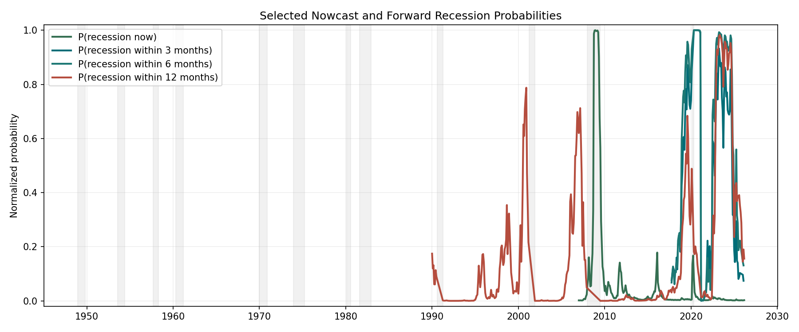
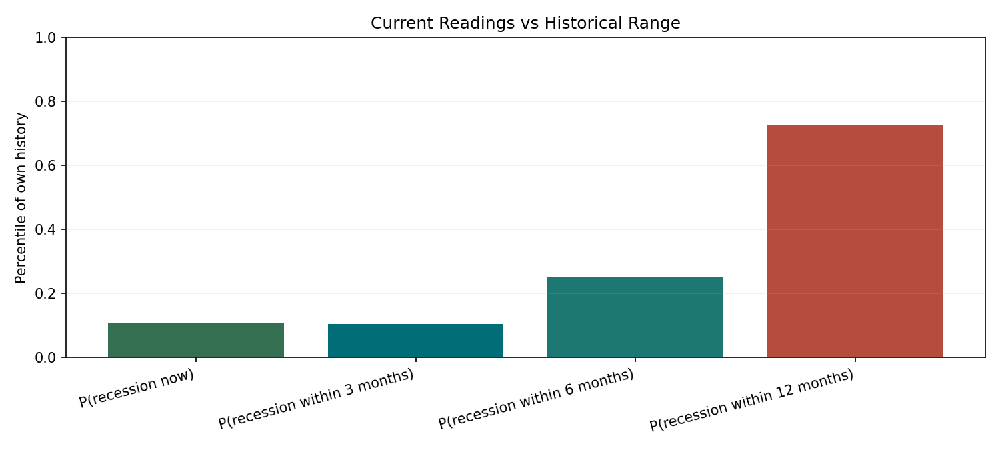
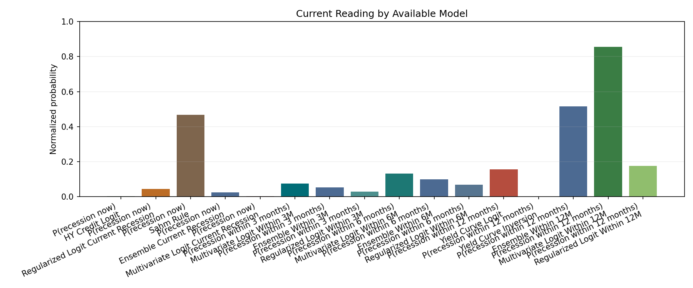
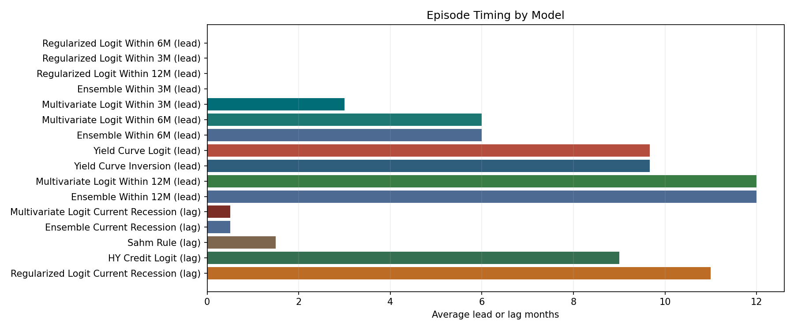
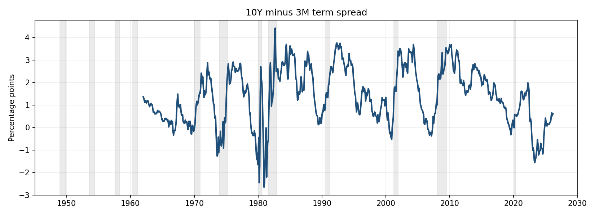
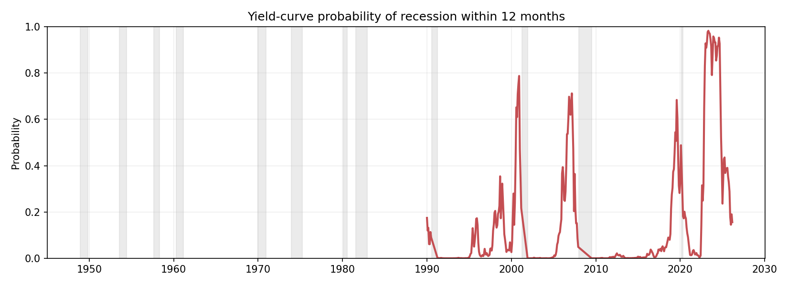
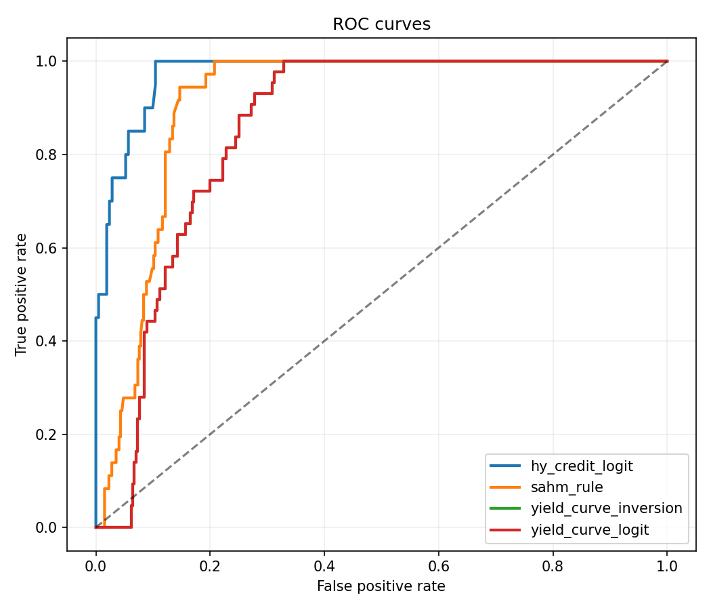
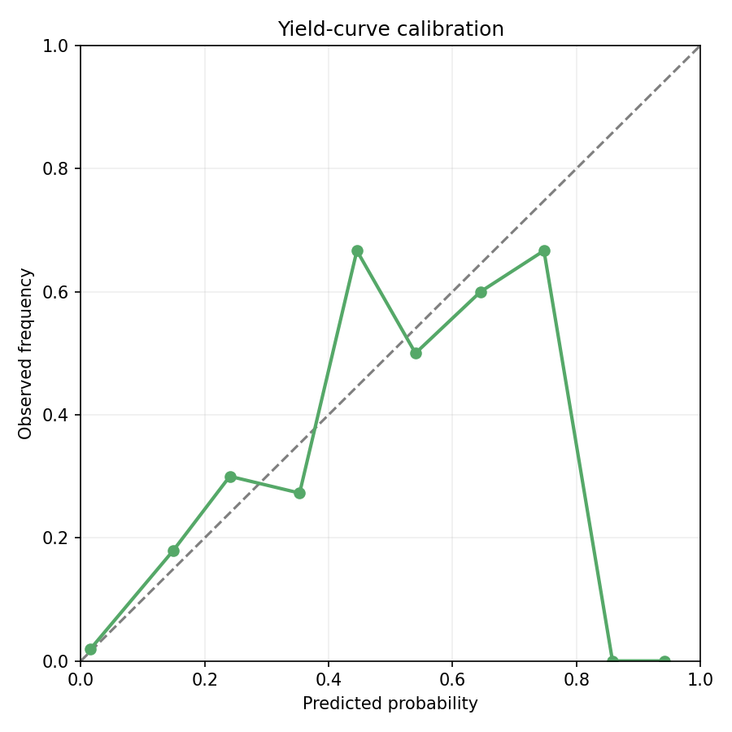

# Recession Risk Monitoring Report

## Current Snapshot

| Target                        | Selected model               | As of      |   Probability |   Historical percentile | Regime      |
|:------------------------------|:-----------------------------|:-----------|--------------:|------------------------:|:------------|
| P(recession now)              | HY Credit Logit              | 2026-03-01 |        0.0026 |                  0.1082 | low risk    |
| P(recession within 3 months)  | Multivariate Logit Within 3M | 2026-02-01 |        0.0743 |                  0.1042 | low risk    |
| P(recession within 6 months)  | Multivariate Logit Within 6M | 2026-02-01 |        0.131  |                  0.25   | low risk    |
| P(recession within 12 months) | Yield Curve Logit            | 2026-03-01 |        0.156  |                  0.7268 | rising risk |

Overall regime: rising risk (driven by P(recession within 12 months))

## Signal Drivers

- The term spread is positive at 0.62, but the curve is steepening.
- HY spreads are relatively contained at 3.16, with the recent direction widening.
- Aggregate recession risk remains in the lower part of its configured range.
- Model disagreement is high; available models diverge materially.

## Current Model Comparison

| Target                        | Model                                | As of      |   Probability |   Raw score |   Historical percentile |    AUC |   Episode recall | Regime               |
|:------------------------------|:-------------------------------------|:-----------|--------------:|------------:|------------------------:|-------:|-----------------:|:---------------------|
| P(recession now)              | HY Credit Logit                      | 2026-03-01 |        0.0026 |      0.0026 |                  0.1082 | 0.9743 |             0.5  | low risk             |
| P(recession now)              | Regularized Logit Current Recession  | 2026-02-01 |        0.0446 |      0.0446 |                  0.1498 | 0.9469 |             0.5  | low risk             |
| P(recession now)              | Sahm Rule                            | 2026-02-01 |        0.4667 |      0.2333 |                  0.7216 | 0.9102 |             1    | elevated risk        |
| P(recession now)              | Ensemble Current Recession           | 2026-02-01 |        0.0239 |      0.0239 |                  0.1101 | 0.6539 |             1    | low risk             |
| P(recession now)              | Multivariate Logit Current Recession | 2026-02-01 |        0.0033 |      0.0033 |                  0.4978 | 0.4459 |             1    | low risk             |
| P(recession within 3 months)  | Multivariate Logit Within 3M         | 2026-02-01 |        0.0743 |      0.0743 |                  0.1042 | 0.7168 |             1    | low risk             |
| P(recession within 3 months)  | Ensemble Within 3M                   | 2026-02-01 |        0.0521 |      0.0521 |                  0.1042 | 0.7168 |             0    | low risk             |
| P(recession within 3 months)  | Regularized Logit Within 3M          | 2026-02-01 |        0.0299 |      0.0299 |                  1      | 0.5    |             0    | low risk             |
| P(recession within 6 months)  | Multivariate Logit Within 6M         | 2026-02-01 |        0.131  |      0.131  |                  0.25   | 0.6259 |             1    | low risk             |
| P(recession within 6 months)  | Ensemble Within 6M                   | 2026-02-01 |        0.0999 |      0.0999 |                  0.25   | 0.613  |             1    | low risk             |
| P(recession within 6 months)  | Regularized Logit Within 6M          | 2026-02-01 |        0.0688 |      0.0688 |                  0.4792 | 0.5426 |             0    | low risk             |
| P(recession within 12 months) | Yield Curve Logit                    | 2026-03-01 |        0.156  |      0.156  |                  0.7268 | 0.8561 |             0.75 | rising risk          |
| P(recession within 12 months) | Yield Curve Inversion                | 2026-03-01 |        0      |     -0.6153 |                  0.8897 | 0.8561 |             0.75 | low risk             |
| P(recession within 12 months) | Ensemble Within 12M                  | 2026-02-01 |        0.5156 |      0.5156 |                  0.2917 | 0.5893 |             1    | elevated risk        |
| P(recession within 12 months) | Multivariate Logit Within 12M        | 2026-02-01 |        0.8543 |      0.8543 |                  0.2708 | 0.5813 |             1    | high / imminent risk |
| P(recession within 12 months) | Regularized Logit Within 12M         | 2026-02-01 |        0.1768 |      0.1768 |                  0.5729 | 0.5367 |             0    | rising risk          |

## Historical Comparison

## Baseline Metrics

| model_name            | target_name       |   horizon | split_name           | test_start   |    auc |   precision |   recall |     f1 |   false_positive_months |   brier_score |      ece |   event_hit_rate |   median_timing_months |   average_timing_months |   flagged_3m_ahead_share |   flagged_6m_ahead_share |   episode_recall |   max_false_alarm_streak |   event_hits |   n_events |
|:----------------------|:------------------|----------:|:---------------------|:-------------|-------:|------------:|---------:|-------:|------------------------:|--------------:|---------:|-----------------:|-----------------------:|------------------------:|-------------------------:|-------------------------:|-----------------:|-------------------------:|-------------:|-----------:|
| yield_curve_logit     | within_12m        |        12 | fixed_1990_holdout   | 1990-01-01   | 0.8561 |      0.3023 |   0.3023 | 0.3023 |                      30 |        0.1128 |   0.0696 |             0.75 |                    9   |                  9.6667 |                     0.75 |                     0.75 |             0.75 |                       25 |            3 |          4 |
| yield_curve_inversion | within_12m        |        12 | fixed_1990_holdout   | 1990-01-01   | 0.8561 |      0.3182 |   0.3256 | 0.3218 |                      30 |      nan      | nan      |             0.75 |                    9   |                  9.6667 |                     0.75 |                     0.75 |             0.75 |                       25 |            3 |          4 |
| hy_credit_logit       | current_recession |         0 | fixed_2007_holdout   | 2007-01-01   | 0.9743 |      0.9    |   0.45   | 0.6    |                       1 |        0.0396 |   0.0324 |             0.5  |                    9   |                  9      |                     0    |                     0    |             0.5  |                        1 |            1 |          2 |
| sahm_rule             | current_recession |         0 | post_1990_monitoring | 1990-01-01   | 0.9102 |      0.3614 |   0.8333 | 0.5042 |                      53 |      nan      | nan      |             1    |                    1.5 |                  1.5    |                     0    |                     0    |             1    |                       19 |            4 |          4 |

## Baseline Figures

## Portfolio Interpretation

- Equities: lean toward quality and earnings resilience.
- Duration: some extra duration ballast becomes more useful.
- Credit beta: lower-quality spread exposure deserves more caution.
- Defensives / cash: optionality and liquidity buffers gain value.

## Notes

- Daily financial series are aggregated to monthly frequency before modeling.
- The current snapshot prefers probability-scored models when multiple models exist for a target.
- Yield-curve models are evaluated on expansion months for forward recession labels.
- HY credit and Sahm rule are evaluated as recession-state detectors.