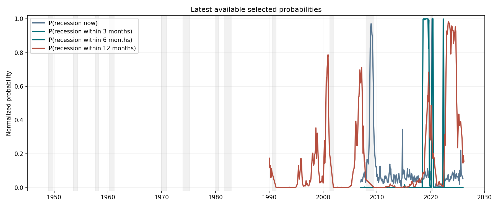
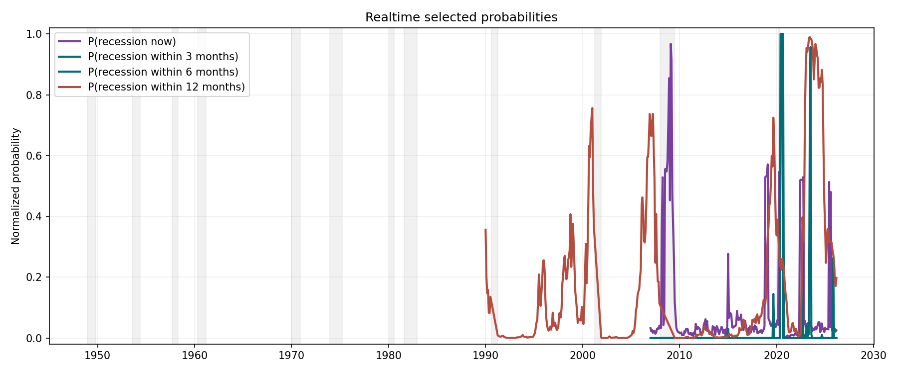
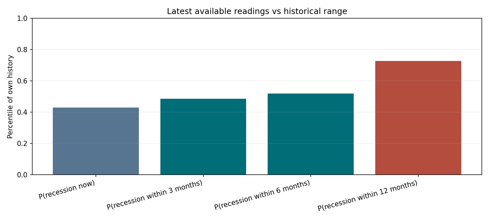
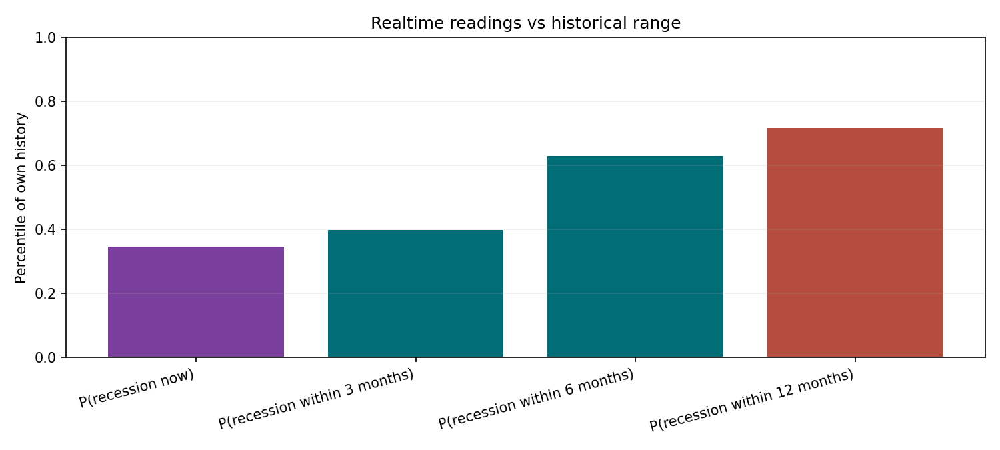
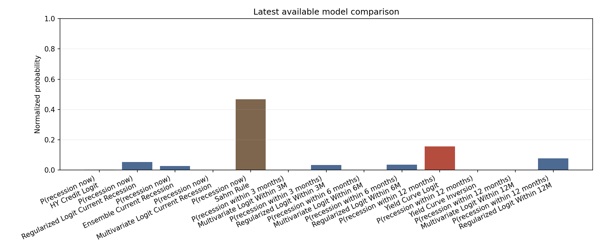
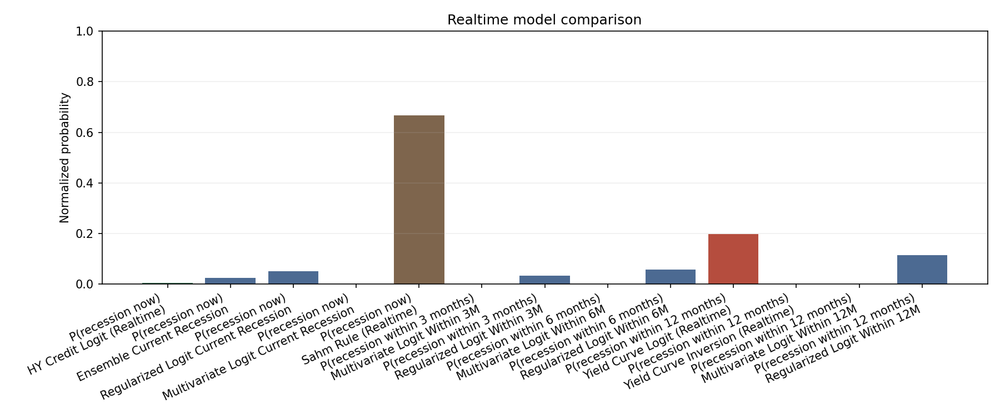

# Recession Risk Monitoring Report

## Current Snapshot

### Latest Available

| Mode             | Target                        | Selected model                      | As of      |   Probability |   Historical percentile | Regime      | Quality gates   | Selection note                                                     |
|:-----------------|:------------------------------|:------------------------------------|:-----------|--------------:|------------------------:|:------------|:----------------|:-------------------------------------------------------------------|
| Latest available | P(recession now)              | Regularized Logit Current Recession | 2026-01-01 |        0.0525 |                  0.4292 | low risk    | pass            | Selected from eligible candidates                                  |
| Latest available | P(recession within 3 months)  | Multivariate Logit Within 3M        | 2026-01-01 |        0      |                  0.4854 | low risk    | fail            | No benchmark candidate available; using best available model.      |
| Latest available | P(recession within 6 months)  | Multivariate Logit Within 6M        | 2026-01-01 |        0      |                  0.5194 | low risk    | fail            | No benchmark candidate available; using best available model.      |
| Latest available | P(recession within 12 months) | Yield Curve Logit                   | 2026-03-01 |        0.156  |                  0.7268 | rising risk | pass            | No expanded model passed quality gates; falling back to benchmark. |

Overall regime: rising risk (driven by P(recession within 12 months))

### Realtime

| Mode     | Target                        | Selected model               | As of      |   Probability |   Historical percentile | Regime      | Quality gates   | Selection note                                                     |
|:---------|:------------------------------|:-----------------------------|:-----------|--------------:|------------------------:|:------------|:----------------|:-------------------------------------------------------------------|
| Realtime | P(recession now)              | Ensemble Current Recession   | 2026-03-01 |        0.0255 |                  0.3463 | low risk    | pass            | Selected from eligible candidates                                  |
| Realtime | P(recession within 3 months)  | Multivariate Logit Within 3M | 2026-03-01 |        0      |                  0.3981 | low risk    | fail            | No benchmark candidate available; using best available model.      |
| Realtime | P(recession within 6 months)  | Multivariate Logit Within 6M | 2026-03-01 |        0      |                  0.6303 | low risk    | fail            | No benchmark candidate available; using best available model.      |
| Realtime | P(recession within 12 months) | Yield Curve Logit (Realtime) | 2026-03-01 |        0.1977 |                  0.7168 | rising risk | pass            | No expanded model passed quality gates; falling back to benchmark. |

Overall realtime regime: rising risk (driven by P(recession within 12 months))

### Latest vs Realtime

| Target                        | Latest available model              | Latest available as of   |   Latest available probability | Latest available regime   | Latest available note                                              | Realtime model               | Realtime as of   |   Realtime probability | Realtime regime   | Realtime note                                                      |   Probability delta | Material gap   |
|:------------------------------|:------------------------------------|:-------------------------|-------------------------------:|:--------------------------|:-------------------------------------------------------------------|:-----------------------------|:-----------------|-----------------------:|:------------------|:-------------------------------------------------------------------|--------------------:|:---------------|
| P(recession now)              | Regularized Logit Current Recession | 2026-01-01               |                         0.0525 | low risk                  | Selected from eligible candidates                                  | Ensemble Current Recession   | 2026-03-01       |                 0.0255 | low risk          | Selected from eligible candidates                                  |              0.027  | False          |
| P(recession within 3 months)  | Multivariate Logit Within 3M        | 2026-01-01               |                         0      | low risk                  | No benchmark candidate available; using best available model.      | Multivariate Logit Within 3M | 2026-03-01       |                 0      | low risk          | No benchmark candidate available; using best available model.      |              0      | False          |
| P(recession within 6 months)  | Multivariate Logit Within 6M        | 2026-01-01               |                         0      | low risk                  | No benchmark candidate available; using best available model.      | Multivariate Logit Within 6M | 2026-03-01       |                 0      | low risk          | No benchmark candidate available; using best available model.      |             -0      | False          |
| P(recession within 12 months) | Yield Curve Logit                   | 2026-03-01               |                         0.156  | rising risk               | No expanded model passed quality gates; falling back to benchmark. | Yield Curve Logit (Realtime) | 2026-03-01       |                 0.1977 | rising risk       | No expanded model passed quality gates; falling back to benchmark. |             -0.0417 | False          |

## Snapshot Governance

| Mode             | Target                        | Model                                | Model family   | Selected   | Selection status   | Quality gates   | Gate reasons                  | Fallback reason                                                    |    AUC |      ECE |   Episode recall |   Max false alarm streak |   Probability |
|:-----------------|:------------------------------|:-------------------------------------|:---------------|:-----------|:-------------------|:----------------|:------------------------------|:-------------------------------------------------------------------|-------:|---------:|-----------------:|-------------------------:|--------------:|
| Latest available | P(recession now)              | HY Credit Logit                      | Benchmark      | False      | eligible_candidate | pass            |                               |                                                                    | 0.9743 |   0.0324 |             0.5  |                        1 |        0.0026 |
| Latest available | P(recession now)              | Regularized Logit Current Recession  | Expanded logit | True       | selected           | pass            |                               |                                                                    | 0.9507 |   0.0596 |             1    |                        2 |        0.0525 |
| Latest available | P(recession now)              | Ensemble Current Recession           | Ensemble       | False      | eligible_candidate | pass            |                               |                                                                    | 0.9498 |   0.0306 |             1    |                        2 |        0.0263 |
| Latest available | P(recession now)              | Multivariate Logit Current Recession | Expanded logit | False      | eligible_candidate | pass            |                               |                                                                    | 0.859  |   0.0663 |             1    |                        2 |        0      |
| Latest available | P(recession now)              | Sahm Rule                            | Benchmark      | False      | rejected           | fail            | max_false_alarm_streak>12     |                                                                    | 0.9102 | nan      |             1    |                       19 |        0.4667 |
| Latest available | P(recession within 3 months)  | Multivariate Logit Within 3M         | Expanded logit | True       | selected           | fail            | episode_recall<0.50           | No benchmark candidate available; using best available model.      | 0.8283 |   0.117  |             0    |                       14 |        0      |
| Latest available | P(recession within 3 months)  | Regularized Logit Within 3M          | Expanded logit | False      | rejected           | fail            | auc<0.65; episode_recall<0.50 |                                                                    | 0.5625 |   0.0073 |             0    |                        0 |        0.0326 |
| Latest available | P(recession within 6 months)  | Multivariate Logit Within 6M         | Expanded logit | True       | selected           | fail            | episode_recall<0.50           | No benchmark candidate available; using best available model.      | 0.7762 |   0.068  |             0    |                        2 |        0      |
| Latest available | P(recession within 6 months)  | Regularized Logit Within 6M          | Expanded logit | False      | rejected           | fail            | episode_recall<0.50           |                                                                    | 0.7053 |   0.0349 |             0    |                        1 |        0.0351 |
| Latest available | P(recession within 12 months) | Yield Curve Logit                    | Benchmark      | True       | selected           | pass            |                               | No expanded model passed quality gates; falling back to benchmark. | 0.8561 |   0.0696 |             0.75 |                       25 |        0.156  |
| Latest available | P(recession within 12 months) | Yield Curve Inversion                | Benchmark      | False      | eligible_candidate | pass            |                               |                                                                    | 0.8561 | nan      |             0.75 |                       25 |        0      |
| Latest available | P(recession within 12 months) | Multivariate Logit Within 12M        | Expanded logit | False      | rejected           | fail            | episode_recall<0.50; ece>0.15 |                                                                    | 0.8166 |   0.188  |             0    |                        6 |        0      |
| Latest available | P(recession within 12 months) | Regularized Logit Within 12M         | Expanded logit | False      | rejected           | fail            | episode_recall<0.50           |                                                                    | 0.7846 |   0.0905 |             0    |                        0 |        0.0768 |
| Realtime         | P(recession now)              | HY Credit Logit (Realtime)           | Benchmark      | False      | eligible_candidate | pass            |                               |                                                                    | 0.9149 |   0.0234 |             0.5  |                        2 |        0.0053 |
| Realtime         | P(recession now)              | Ensemble Current Recession           | Ensemble       | True       | selected           | pass            |                               |                                                                    | 0.8976 |   0.0389 |             1    |                        5 |        0.0255 |
| Realtime         | P(recession now)              | Regularized Logit Current Recession  | Expanded logit | False      | eligible_candidate | pass            |                               |                                                                    | 0.8322 |   0.0212 |             0.5  |                        3 |        0.051  |
| Realtime         | P(recession now)              | Multivariate Logit Current Recession | Expanded logit | False      | eligible_candidate | pass            |                               |                                                                    | 0.8201 |   0.1054 |             1    |                        5 |        0      |
| Realtime         | P(recession now)              | Sahm Rule (Realtime)                 | Benchmark      | False      | rejected           | fail            | max_false_alarm_streak>12     |                                                                    | 0.8273 | nan      |             0.75 |                       22 |        0.6667 |
| Realtime         | P(recession within 3 months)  | Multivariate Logit Within 3M         | Expanded logit | True       | selected           | fail            | episode_recall<0.50           | No benchmark candidate available; using best available model.      | 0.7333 |   0.0438 |             0    |                        3 |        0      |
| Realtime         | P(recession within 3 months)  | Regularized Logit Within 3M          | Expanded logit | False      | rejected           | fail            | auc<0.65; episode_recall<0.50 |                                                                    | 0.5943 |   0.0098 |             0    |                        0 |        0.0332 |
| Realtime         | P(recession within 6 months)  | Multivariate Logit Within 6M         | Expanded logit | True       | selected           | fail            | episode_recall<0.50           | No benchmark candidate available; using best available model.      | 0.7755 |   0.0834 |             0    |                        4 |        0      |
| Realtime         | P(recession within 6 months)  | Regularized Logit Within 6M          | Expanded logit | False      | rejected           | fail            | episode_recall<0.50           |                                                                    | 0.7353 |   0.0174 |             0    |                        1 |        0.0565 |
| Realtime         | P(recession within 12 months) | Yield Curve Logit (Realtime)         | Benchmark      | True       | selected           | pass            |                               | No expanded model passed quality gates; falling back to benchmark. | 0.8661 |   0.0781 |             0.75 |                       24 |        0.1977 |
| Realtime         | P(recession within 12 months) | Yield Curve Inversion (Realtime)     | Benchmark      | False      | eligible_candidate | pass            |                               |                                                                    | 0.8678 | nan      |             0.75 |                       25 |        0      |
| Realtime         | P(recession within 12 months) | Multivariate Logit Within 12M        | Expanded logit | False      | rejected           | fail            | episode_recall<0.50; ece>0.15 |                                                                    | 0.8128 |   0.2032 |             0    |                       17 |        0      |
| Realtime         | P(recession within 12 months) | Regularized Logit Within 12M         | Expanded logit | False      | rejected           | fail            | episode_recall<0.50           |                                                                    | 0.7928 |   0.1115 |             0    |                        0 |        0.1153 |

## Signal Drivers

### Latest Available

- The term spread is positive at 0.62, but the curve is steepening.
- HY spreads are relatively contained at 3.16, with the recent direction widening.
- Aggregate recession risk remains in the lower part of its configured range.
- Model disagreement is moderate; direction is shared but conviction differs.
- Latest-available and realtime snapshots are broadly aligned.

### Realtime

- The term spread is positive at 0.52, but the curve is steepening.
- HY spreads are relatively contained at 2.92, with the recent direction widening.
- The Sahm gap is 0.33, below the trigger but no longer comfortably benign.
- Aggregate recession risk remains in the lower part of its configured range.
- Model disagreement is moderate; direction is shared but conviction differs.
- Latest-available and realtime snapshots are broadly aligned.

## Current Model Comparison

### Latest Available

| Mode             | Target                        | Model                                | As of      |   Probability |   Raw score |   Calibrated score |   Historical percentile |    AUC |   Episode recall | Quality gates   | Gate reasons                  | Regime        |
|:-----------------|:------------------------------|:-------------------------------------|:-----------|--------------:|------------:|-------------------:|------------------------:|-------:|-----------------:|:----------------|:------------------------------|:--------------|
| Latest available | P(recession now)              | HY Credit Logit                      | 2026-03-01 |        0.0026 |    nan      |             0.0026 |                  0.1082 | 0.9743 |             0.5  | pass            |                               | low risk      |
| Latest available | P(recession now)              | Regularized Logit Current Recession  | 2026-01-01 |        0.0525 |      0.0525 |             0.0525 |                  0.4292 | 0.9507 |             1    | pass            |                               | low risk      |
| Latest available | P(recession now)              | Ensemble Current Recession           | 2026-01-01 |        0.0263 |      0.0263 |             0.0263 |                  0.4292 | 0.9498 |             1    | pass            |                               | low risk      |
| Latest available | P(recession now)              | Multivariate Logit Current Recession | 2026-01-01 |        0      |      0      |             0      |                  0.7478 | 0.859  |             1    | pass            |                               | low risk      |
| Latest available | P(recession now)              | Sahm Rule                            | 2026-02-01 |        0.4667 |    nan      |             0.2333 |                  0.7216 | 0.9102 |             1    | fail            | max_false_alarm_streak>12     | elevated risk |
| Latest available | P(recession within 3 months)  | Multivariate Logit Within 3M         | 2026-01-01 |        0      |      0      |             0      |                  0.4854 | 0.8283 |             0    | fail            | episode_recall<0.50           | low risk      |
| Latest available | P(recession within 3 months)  | Regularized Logit Within 3M          | 2026-01-01 |        0.0326 |      0.0326 |             0.0326 |                  0.1262 | 0.5625 |             0    | fail            | auc<0.65; episode_recall<0.50 | low risk      |
| Latest available | P(recession within 6 months)  | Multivariate Logit Within 6M         | 2026-01-01 |        0      |      0      |             0      |                  0.5194 | 0.7762 |             0    | fail            | episode_recall<0.50           | low risk      |
| Latest available | P(recession within 6 months)  | Regularized Logit Within 6M          | 2026-01-01 |        0.0351 |      0.0351 |             0.0351 |                  0.267  | 0.7053 |             0    | fail            | episode_recall<0.50           | low risk      |
| Latest available | P(recession within 12 months) | Yield Curve Logit                    | 2026-03-01 |        0.156  |    nan      |             0.156  |                  0.7268 | 0.8561 |             0.75 | pass            |                               | rising risk   |
| Latest available | P(recession within 12 months) | Yield Curve Inversion                | 2026-03-01 |        0      |    nan      |            -0.6153 |                  0.8897 | 0.8561 |             0.75 | pass            |                               | low risk      |
| Latest available | P(recession within 12 months) | Multivariate Logit Within 12M        | 2026-01-01 |        0      |      0      |             0      |                  0.6845 | 0.8166 |             0    | fail            | episode_recall<0.50; ece>0.15 | low risk      |
| Latest available | P(recession within 12 months) | Regularized Logit Within 12M         | 2026-01-01 |        0.0768 |      0.0768 |             0.0768 |                  0.5194 | 0.7846 |             0    | fail            | episode_recall<0.50           | low risk      |

### Realtime

| Mode     | Target                        | Model                                | As of      |   Probability |   Raw score |   Calibrated score |   Historical percentile |    AUC |   Episode recall | Quality gates   | Gate reasons                  | Regime               |
|:---------|:------------------------------|:-------------------------------------|:-----------|--------------:|------------:|-------------------:|------------------------:|-------:|-----------------:|:----------------|:------------------------------|:---------------------|
| Realtime | P(recession now)              | HY Credit Logit (Realtime)           | 2026-03-01 |        0.0053 |    nan      |             0.0053 |                  0.0779 | 0.9149 |             0.5  | pass            |                               | low risk             |
| Realtime | P(recession now)              | Ensemble Current Recession           | 2026-03-01 |        0.0255 |      0.0255 |             0.0255 |                  0.3463 | 0.8976 |             1    | pass            |                               | low risk             |
| Realtime | P(recession now)              | Regularized Logit Current Recession  | 2026-03-01 |        0.051  |      0.051  |             0.051  |                  0.3766 | 0.8322 |             0.5  | pass            |                               | low risk             |
| Realtime | P(recession now)              | Multivariate Logit Current Recession | 2026-03-01 |        0      |      0      |             0      |                  0.7186 | 0.8201 |             1    | pass            |                               | low risk             |
| Realtime | P(recession now)              | Sahm Rule (Realtime)                 | 2026-03-01 |        0.6667 |    nan      |             0.3333 |                  0.7701 | 0.8273 |             0.75 | fail            | max_false_alarm_streak>12     | high / imminent risk |
| Realtime | P(recession within 3 months)  | Multivariate Logit Within 3M         | 2026-03-01 |        0      |      0      |             0      |                  0.3981 | 0.7333 |             0    | fail            | episode_recall<0.50           | low risk             |
| Realtime | P(recession within 3 months)  | Regularized Logit Within 3M          | 2026-03-01 |        0.0332 |      0.0332 |             0.0332 |                  0.1469 | 0.5943 |             0    | fail            | auc<0.65; episode_recall<0.50 | low risk             |
| Realtime | P(recession within 6 months)  | Multivariate Logit Within 6M         | 2026-03-01 |        0      |      0      |             0      |                  0.6303 | 0.7755 |             0    | fail            | episode_recall<0.50           | low risk             |
| Realtime | P(recession within 6 months)  | Regularized Logit Within 6M          | 2026-03-01 |        0.0565 |      0.0565 |             0.0565 |                  0.4929 | 0.7353 |             0    | fail            | episode_recall<0.50           | low risk             |
| Realtime | P(recession within 12 months) | Yield Curve Logit (Realtime)         | 2026-03-01 |        0.1977 |    nan      |             0.1977 |                  0.7168 | 0.8661 |             0.75 | pass            |                               | rising risk          |
| Realtime | P(recession within 12 months) | Yield Curve Inversion (Realtime)     | 2026-03-01 |        0      |    nan      |            -0.5242 |                  0.8922 | 0.8678 |             0.75 | pass            |                               | low risk             |
| Realtime | P(recession within 12 months) | Multivariate Logit Within 12M        | 2026-03-01 |        0      |      0      |             0      |                  0.6635 | 0.8128 |             0    | fail            | episode_recall<0.50; ece>0.15 | low risk             |
| Realtime | P(recession within 12 months) | Regularized Logit Within 12M         | 2026-03-01 |        0.1153 |      0.1153 |             0.1153 |                  0.6303 | 0.7928 |             0    | fail            | episode_recall<0.50           | low risk             |

## Historical Comparison

## Baseline Metrics

| model_name            | target_name       |   horizon | split_name           | test_start   |    auc |   precision |   recall |     f1 |   false_positive_months |   brier_score |      ece |   event_hit_rate |   median_timing_months |   average_timing_months |   flagged_3m_ahead_share |   flagged_6m_ahead_share |   episode_recall |   max_false_alarm_streak |   event_hits |   n_events |
|:----------------------|:------------------|----------:|:---------------------|:-------------|-------:|------------:|---------:|-------:|------------------------:|--------------:|---------:|-----------------:|-----------------------:|------------------------:|-------------------------:|-------------------------:|-----------------:|-------------------------:|-------------:|-----------:|
| yield_curve_logit     | within_12m        |        12 | fixed_1990_holdout   | 1990-01-01   | 0.8561 |      0.3023 |   0.3023 | 0.3023 |                      30 |        0.1128 |   0.0696 |             0.75 |                    9   |                  9.6667 |                     0.75 |                     0.75 |             0.75 |                       25 |            3 |          4 |
| yield_curve_inversion | within_12m        |        12 | fixed_1990_holdout   | 1990-01-01   | 0.8561 |      0.3182 |   0.3256 | 0.3218 |                      30 |      nan      | nan      |             0.75 |                    9   |                  9.6667 |                     0.75 |                     0.75 |             0.75 |                       25 |            3 |          4 |
| hy_credit_logit       | current_recession |         0 | fixed_2007_holdout   | 2007-01-01   | 0.9743 |      0.9    |   0.45   | 0.6    |                       1 |        0.0396 |   0.0324 |             0.5  |                    9   |                  9      |                     0    |                     0    |             0.5  |                        1 |            1 |          2 |
| sahm_rule             | current_recession |         0 | post_1990_monitoring | 1990-01-01   | 0.9102 |      0.3614 |   0.8333 | 0.5042 |                      53 |      nan      | nan      |             1    |                    1.5 |                  1.5    |                     0    |                     0    |             1    |                       19 |            4 |          4 |

## Baseline Figures

## Portfolio Interpretation

- Equities: lean toward quality and earnings resilience.
- Duration: some extra duration ballast becomes more useful.
- Credit beta: lower-quality spread exposure deserves more caution.
- Defensives / cash: optionality and liquidity buffers gain value.

## Notes

- Benchmarks remain the permanent reference layer and are retained even when expanded models are available.
- Expanded-model snapshots are quality-gated; if no expanded candidate passes, the report falls back to the best benchmark for that target.
- Latest-available and realtime views are reported separately to avoid presenting hindsight and as-of probabilities as the same object.
- Rule models remain uncalibrated signals; probability-scored expanded models use calibrated probabilities in investor-facing outputs.